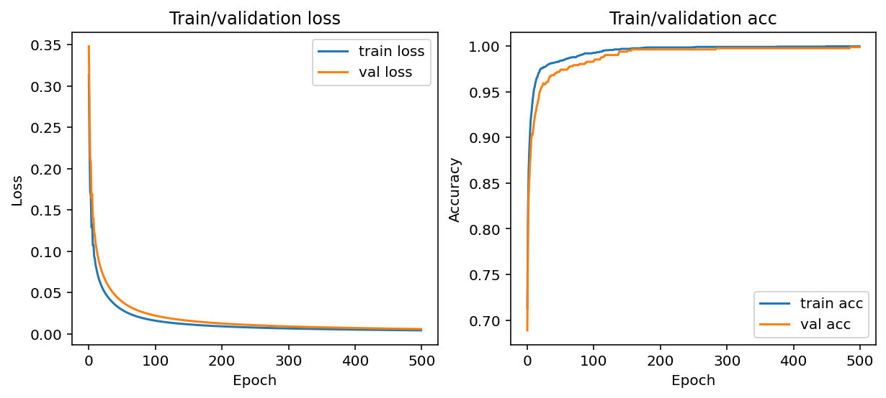

# mushroom-prediction

Train a simple logistic regression model to predict if a mushroom is poisonous based on qualitative features. The [`train_autodiff.py`](train_autodiff.py) implementation uses **stochastic** gradient descent for optimization and auto differentiation (PyTorch) for gradient update, whereas the [`train_vanilla.py`](train_vanilla.py) one uses **batch** gradient descent and calculates the gradient and updates it explicitly.

The mushroom dataset [1] is from UCI Machine Learning Repository.


## Hyperparameters

Vanilla:
| Hyperparameter |       Value        |
| :------------: | :----------------: |
|    # epochs    |        500         |
| Learning rate  |        2.0         |
|   Batch size   | training data size |

Auto diff:
| Hyperparameter | Value |
| :------------: | :---: |
|    # epochs    |  50   |
| Learning rate  |  0.1  |
|   Batch size   |  32   |


## Performance

Vanilla:
|                  | Cross-entropy loss | Accuracy |
| :--------------: | :----------------: | :------: |
|   Train (3249)   |       0.0042       |  0.9997  |
| Validation (813) |       0.0059       |  0.9988  |
|   Test (4062)    |       0.0044       |  0.9993  |



Auto diff:
|                  | Cross-entropy loss | Accuracy |
| :--------------: | :----------------: | :------: |
|   Train (3249)   |       0.0000       |  0.9991  |
| Validation (813) |       0.0004       |  0.9988  |
|   Test (4062)    |       0.0004       |  0.9994  |


## How to run

```shell
wget -nv https://archive.ics.uci.edu/ml/machine-learning-databases/mushroom/agaricus-lepiota.data
python3 train_vanilla.py
python3 train_autodiff.py
```


## References

1. [Mushroom Data Set](https://archive.ics.uci.edu/ml/datasets/mushroom)